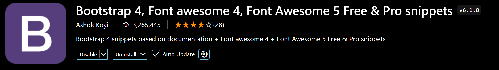
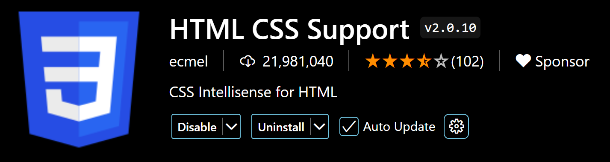
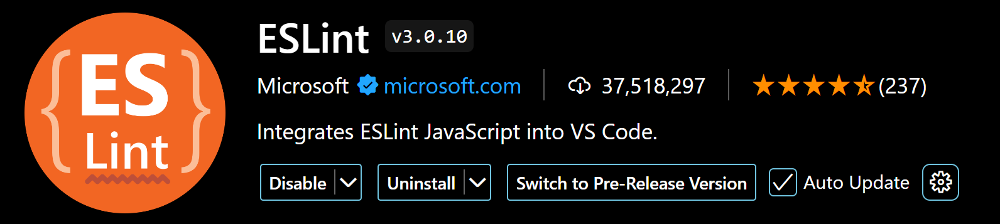
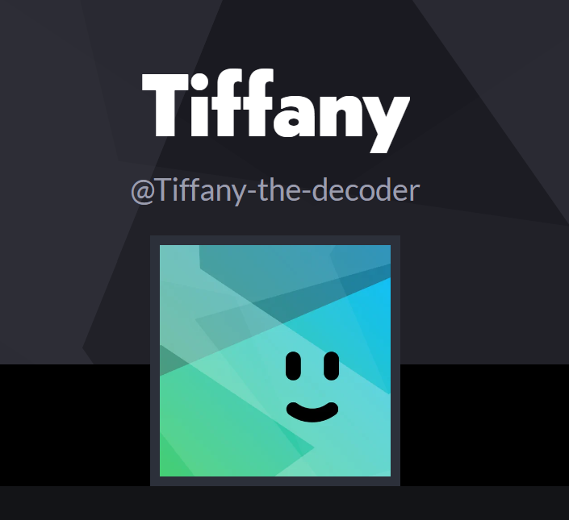

> [!NOTE]
> *I don't know how to properly use GitHub yet. My bad.*

# HCI-Lab-class
This is for HCI Lab class.
Everything will be added in a new folder each week.

### Student info for easy grading
NIM: 2802503791

## Setup 
- **OS:** Windows 11
- **IDE:** VS Code
- **VS Code plugins** for web development and why (*I just installed these, srry*):
  - **Live Server** - Ritwick Dey (real time updates of website)
  - **Bootstrap 4** - Ashok Koyi (easy templates/ decor that is intergrateable with mobile devices)
  - **HTML CSS Support** - ecmel (intellisense/ code completion)
  - **ESLint** - Microsoft (linter for JS)
<table>
  <tr>
    <th>
      <source media="(prefers-color-scheme: dark)" srcset="Session_01/live-server_ritwick-dey_VSC-extension.png">
      <source media="(prefers-color-scheme: light)" srcset="Session_01/live-server_ritwick-dey_VSC-extension.png">
       
    </th>
    <th>
      <source media="(prefers-color-scheme: dark)" srcset="Session_01/bootstrap-4_ashok-koyi_VSC-extension.png">
      <source media="(prefers-color-scheme: light)" srcset="Session_01/bootstrap-4_ashok-koyi_VSC-extension.png">
       
    </th>
  </tr>
  <tr>
    <th>
      <source media="(prefers-color-scheme: dark)" srcset="Session_01/html-css-support_ecmel_VSC-extension.png">
      <source media="(prefers-color-scheme: light)" srcset="Session_01/html-css-support_ecmel_VSC-extension.png">
       
    </th>
    <th>
      <source media="(prefers-color-scheme: dark)" srcset="Session_01/eslint_microsoft_VSC-extension.png">
      <source media="(prefers-color-scheme: light)" srcset="Session_01/eslint_microsoft_VSC-extension.png">
       
    </th>
  </tr>
</table>

- **Other tools** I've used:
  - **Node.js** - JS runtime environment... can be used to make a server, if my understanding isn't wrong.
  - **Apache** - Server environment, locally. Offline.
  - **Ngrok** - With this my computer is the web server and I don't need to upload my files somewhere else. I can access the site on my phone.
  - **SQLiteDatabaseBrowserPortable** - https://sqlitebrowser.org/ (Portable and lightweight database editor.)

## CodePen
<picture>
  <source media="(prefers-color-scheme: dark)" srcset="Session_01/Codepen1.png">
  <source media="(prefers-color-scheme: light)" srcset="Session_01/Codepen1.png">
   
</picture>
<picture>
  <source media="(prefers-color-scheme: dark)" srcset="Session_01/Codepen2.png">
  <source media="(prefers-color-scheme: light)" srcset="Session_01/Codepen2.png">
  
</picture>

## Figma
<picture>
  <source media="(prefers-color-scheme: dark)" srcset="Session_01/Figma.png">
  <source media="(prefers-color-scheme: light)" srcset="Session_01/Figma.png">
  
</picture>
